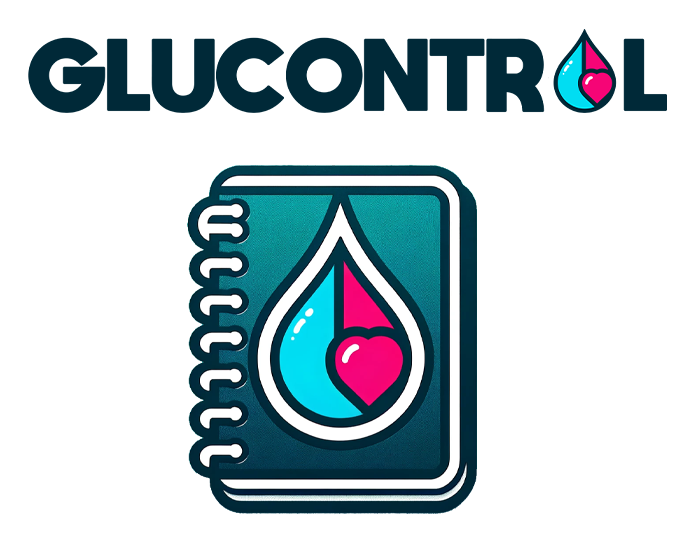
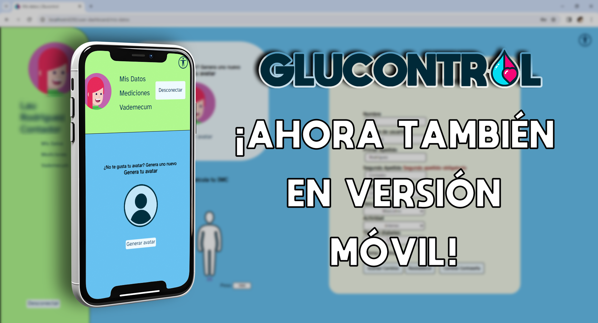
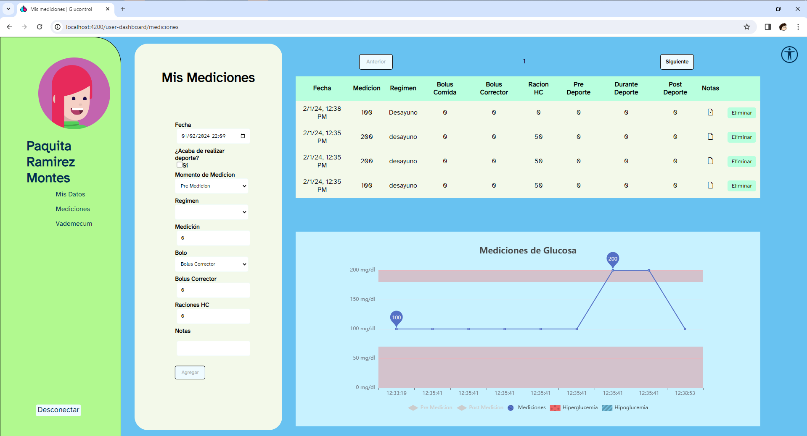
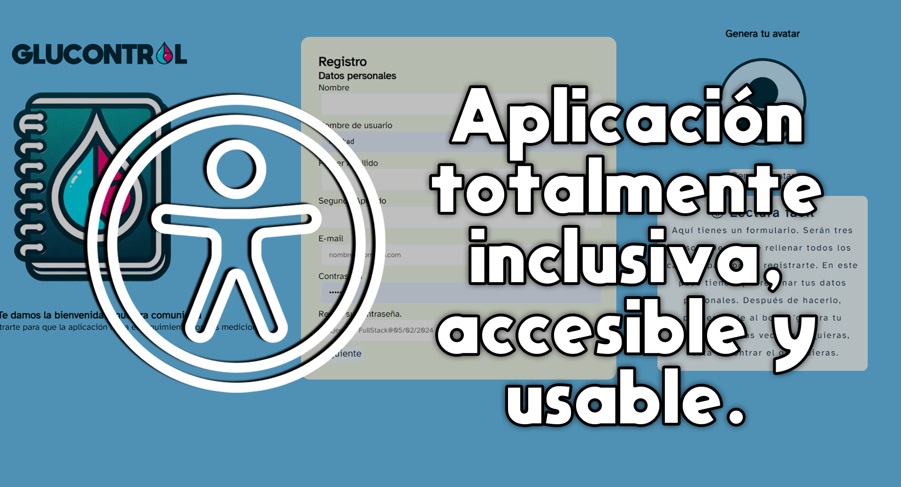
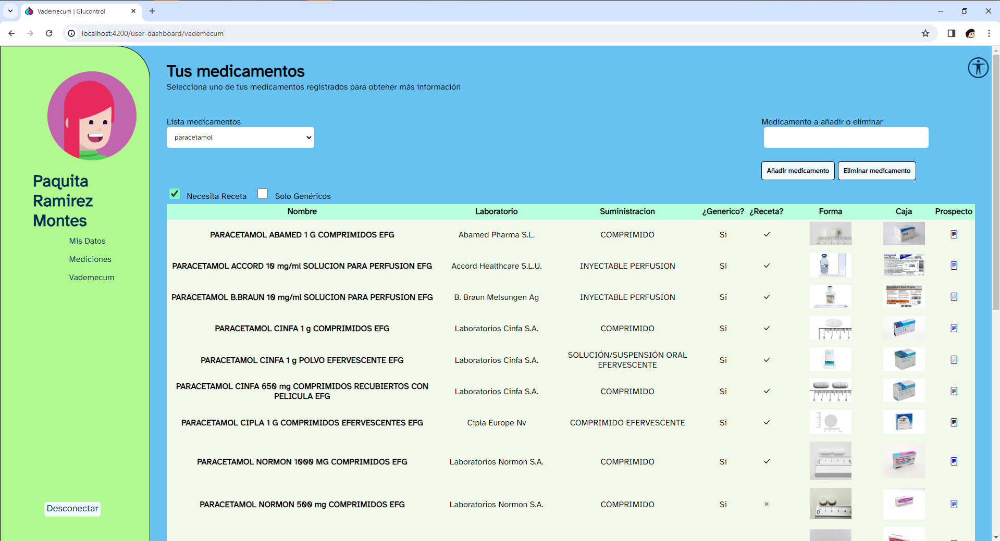

# Glucontrol_App 📈

Glucontrol_App es una aplicación avanzada diseñada para facilitar la gestión y el seguimiento de la diabetes. Este proyecto es el resultado de una formación impartida por Inserta Arelance, combinando conocimientos teóricos y prácticos para desarrollar una solución tecnológica integral y accesible para pacientes con diabetes y profesionales de la salud.

## Backend: DiabetesNoteBook 📚

El backend de **DiabetesNoteBook** es una solución integral diseñada para facilitar la gestión y el seguimiento de la diabetes, proporcionando una plataforma robusta y segura para el manejo de datos relacionados con la salud. Desarrollado con **ASP.NET Core MVC**, **Entity Framework Core**, y **SQL Server**, este backend se centra en ofrecer una experiencia de usuario fluida y segura, asegurando al mismo tiempo la integridad y privacidad de los datos.

### Características Principales

- **Gestión de Usuarios**: Implementa un sistema completo de autenticación y manejo de perfiles, incluyendo registro de usuarios, confirmación de correo electrónico, inicio de sesión, y actualización de datos de perfil. Utiliza prácticas de seguridad avanzadas como el hashing de contraseñas y la generación y manejo de tokens JWT para autenticación.

- **Seguridad**: Asegura la comunicación y el almacenamiento de datos mediante el uso de técnicas de encriptación avanzadas y la implementación de políticas de seguridad estrictas, protegiendo contra vulnerabilidades comunes y asegurando la privacidad de los datos de los usuarios.

- **Manejo de Mediciones**: Permite a los usuarios añadir, consultar y eliminar mediciones de glucosa, así como otros datos relevantes para el seguimiento de su salud. Ofrece funcionalidades para el análisis y visualización de estas mediciones, facilitando el seguimiento de la evolución de la enfermedad.

- **Operaciones de Auditoría**: Registra las acciones realizadas por los usuarios en el sistema para facilitar el seguimiento, la auditoría y la mejora continua de la plataforma. Esto incluye la gestión de mediciones, cambios en los datos del perfil y más.

### Tecnologías y Herramientas Utilizadas

- **ASP.NET Core MVC**: Utilizado para construir la lógica de negocio y la capa de presentación, aprovechando su modelo de desarrollo basado en MVC para una separación clara entre la interfaz de usuario y la lógica de negocio.

- **Entity Framework Core**: Empleado para el acceso y manejo de la base de datos, facilitando las operaciones CRUD y la migración de datos de manera eficiente y segura.

- **SQL Server**: Como sistema de gestión de base de datos, proporciona un almacenamiento seguro y escalable para los datos de la aplicación, incluyendo mediciones de glucosa, información de usuarios y registros de auditoría.

### Estructura del Proyecto

El proyecto está estructurado en múltiples capas, incluyendo:

- **Modelos de Dominio**: Definen la estructura de los datos y las relaciones entre ellos, reflejando el esquema de la base de datos en el código.

- **DTOs (Data Transfer Objects)**: Facilitan la transferencia de datos entre la interfaz de usuario y la lógica de negocio, asegurando que solo se expongan los datos necesarios.

- **Servicios de Aplicación**: Contienen la lógica de negocio principal, incluyendo la gestión de usuarios, mediciones y operaciones de auditoría.

- **Controladores**: Actúan como intermediarios entre la interfaz de usuario y los servicios de aplicación, manejando las solicitudes HTTP y devolviendo las respuestas adecuadas.

- **Interfaces y Repositorios**: Abstraen el acceso a la base de datos, permitiendo una mayor flexibilidad y mantenibilidad del código.

Este enfoque modular y basado en capas facilita el mantenimiento y la escalabilidad del proyecto, permitiendo la evolución continua del backend para satisfacer las necesidades cambiantes de los usuarios y las mejores prácticas en el desarrollo de software.

### 🚀 Instrucciones de Instalación

1. Clona el repositorio.
2. Instala .NET Core SDK y SQL Server.
3. Restaura la base de datos utilizando el archivo `.bak`.
4. **Configura los secretos de usuario** en el backend para asegurar la correcta autenticación y seguridad.
5. Configura la cadena de conexión en `appsettings.json`.
6. Ejecuta `dotnet restore` y `dotnet run`.

## Frontend 🖥️

El frontend de **DiabetesNoteBook** ofrece una experiencia de usuario rica e interactiva, diseñada para ser intuitiva y accesible para todos, incluidos aquellos con diversidad funcional. Desarrollado con tecnologías modernas como **Angular**, **TypeScript** y **CSS**, este frontend se centra en proporcionar una interfaz amigable y eficiente para la gestión de la diabetes.

### Características Principales

- **Registro e Inicio de Sesión**: Interfaces intuitivas que facilitan el proceso de registro e inicio de sesión de los usuarios, asegurando una experiencia de usuario fluida desde el primer momento.

- **Dashboard de Usuario**: Un panel de control personalizado que permite a los usuarios visualizar y gestionar sus mediciones personales de glucosa, así como acceder a información relevante para el manejo de su salud.

- **Accesibilidad**: Implementación de características de accesibilidad para asegurar que la aplicación sea usable por personas con diversidad funcional, incluyendo opciones de alto contraste, navegación simplificada y soporte para lectores de pantalla.

### Tecnologías Aplicadas en el Frontend

- **Angular**: Utilizado para construir una aplicación de página única (SPA) que ofrece una experiencia de usuario fluida y dinámica.

- **TypeScript**: Proporciona un entorno de desarrollo más seguro y eficiente, permitiendo el uso de tipado estático para prevenir errores en tiempo de ejecución.

- **CSS**: Para la estilización de la aplicación, asegurando una interfaz atractiva y coherente en diferentes dispositivos y tamaños de pantalla.

### Integración con APIs Externas

- **Generador de Avatares**: Utiliza una API externa para generar avatares personalizados para los perfiles de usuario, añadiendo un toque personal y único a la experiencia de usuario.

- **Vademécum**: Conecta con la API de CIMA para proporcionar información detallada sobre medicamentos, facilitando a los usuarios el acceso a información vital para el manejo de su salud.

### Seguridad y Rendimiento con Guards y Lazy Routing

- Incorporamos Guards para controlar el acceso a rutas específicas, asegurando que solo usuarios autorizados puedan acceder a información sensible, reforzando la seguridad de la aplicación. Además, utilizamos Lazy Routing para optimizar el rendimiento, cargando módulos de forma perezosa solo cuando son necesarios. Esta estrategia reduce el tiempo de carga inicial, mejorando la experiencia de usuario en dispositivos con recursos limitados.

### Directivas y Pipes

- **LazyLoadImageDirective**: Mejora el rendimiento de la aplicación mediante la carga diferida de imágenes, reduciendo el tiempo de carga inicial y el consumo de datos.

- **FiltroGenericosPipe** y **FiltroSinRecetaPipe**: Permiten a los usuarios filtrar medicamentos basándose en características específicas, como si son genéricos o si requieren receta, mejorando la experiencia de búsqueda y selección de medicamentos.

### 🚀 Instrucciones de Instalación

1. Navega al directorio del frontend.
2. Ejecuta `npm install` y `ng serve`.
3. Accede a `http://localhost:4200`.

Este proyecto, fruto de la formación de Inserta y Arelance, demuestra el compromiso con la creación de soluciones tecnológicas accesibles y de alto impacto para la sociedad, abordando las necesidades de personas con condiciones crónicas como la diabetes.

---

Capturas de la aplicacion:

Para más información sobre medicamentos, visita el [Vademécum de la AEMPS](https://cima.aemps.es/cima/publico/nomenclator.html).

